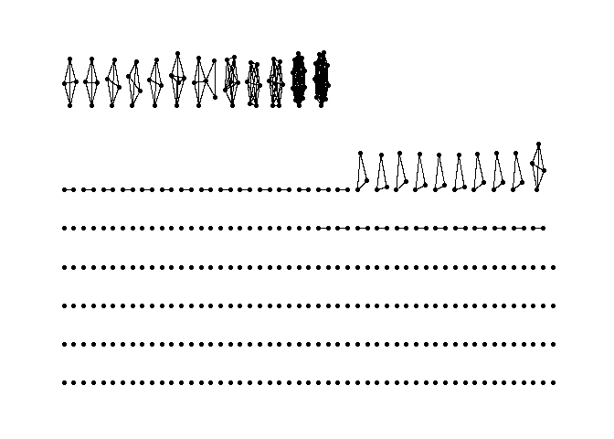

Exercise 1
================

Load required packages

``` r
library("tidyverse")
```

    ## ── Attaching packages ─────────────────────────────────────── tidyverse 1.3.1 ──

    ## ✔ ggplot2 3.3.5     ✔ purrr   0.3.4
    ## ✔ tibble  3.1.6     ✔ dplyr   1.0.9
    ## ✔ tidyr   1.2.0     ✔ stringr 1.4.0
    ## ✔ readr   2.1.2     ✔ forcats 0.5.1

    ## ── Conflicts ────────────────────────────────────────── tidyverse_conflicts() ──
    ## ✖ dplyr::filter() masks stats::filter()
    ## ✖ dplyr::lag()    masks stats::lag()

``` r
library("igraph")
```

    ## 
    ## Attaching package: 'igraph'

    ## The following objects are masked from 'package:dplyr':
    ## 
    ##     as_data_frame, groups, union

    ## The following objects are masked from 'package:purrr':
    ## 
    ##     compose, simplify

    ## The following object is masked from 'package:tidyr':
    ## 
    ##     crossing

    ## The following object is masked from 'package:tibble':
    ## 
    ##     as_data_frame

    ## The following objects are masked from 'package:stats':
    ## 
    ##     decompose, spectrum

    ## The following object is masked from 'package:base':
    ## 
    ##     union

## Loading Dataset

Import dataset (my own personal LinkedIn connections data)

``` r
con_fixed = read_csv('connections_fixed.csv')
```

    ## Rows: 409 Columns: 6
    ## ── Column specification ────────────────────────────────────────────────────────
    ## Delimiter: ","
    ## chr (6): First Name, Last Name, Email Address, Company, Position, Connected On
    ## 
    ## ℹ Use `spec()` to retrieve the full column specification for this data.
    ## ℹ Specify the column types or set `show_col_types = FALSE` to quiet this message.

``` r
con_fixed %>% drop_na(Company)
```

    ## # A tibble: 400 × 6
    ##    `First Name`      `Last Name` `Email Address` Company Position `Connected On`
    ##    <chr>             <chr>       <chr>           <chr>   <chr>    <chr>         
    ##  1 Ilnaz             Bamdadi     <NA>            BNP Pa… AVP - M… 28-Apr-22     
    ##  2 Alexis            de Pampelo… <NA>            Keurig… Busines… 28-Apr-22     
    ##  3 Changseung (Chan… Yoo         <NA>            McGill… Assista… 25-Apr-22     
    ##  4 Jonathan          Guzzo       <NA>            BNP Pa… Vice Pr… 18-Apr-22     
    ##  5 Laura             Park        <NA>            Dash H… Senior … 18-Apr-22     
    ##  6 Chelsea           Hon         <NA>            Accent… Managem… 18-Apr-22     
    ##  7 Jack              Liang       <NA>            McKess… Data An… 18-Apr-22     
    ##  8 Marion            Laniel      <NA>            Apple   Technic… 17-Mar-22     
    ##  9 Solomon           Gomez       <NA>            Gorgias Growth … 09-Mar-22     
    ## 10 Vaibhav           Vishal      <NA>            Air Tr… Analyti… 05-Mar-22     
    ## # … with 390 more rows

## Get count of contacts by employer

``` r
company_summary = con_fixed %>% count(Company, sort=TRUE)
 
company_summary
```

    ## # A tibble: 292 × 2
    ##    Company                                                 n
    ##    <chr>                                               <int>
    ##  1 McGill University - Desautels Faculty of Management    11
    ##  2 Verafin                                                11
    ##  3 <NA>                                                    9
    ##  4 ExxonMobil                                              7
    ##  5 Cenovus Energy                                          6
    ##  6 Imperial Oil                                            6
    ##  7 Irving Shipbuilding                                     5
    ##  8 Hatch                                                   4
    ##  9 Intact                                                  4
    ## 10 Memorial University of Newfoundland                     4
    ## # … with 282 more rows

## Create Nodes and Edges Dataframe with igraph

### Create Nodes Dataframe

First, create a new column with first name and first letter of last name
as the label

``` r
con_fixed$last_initial <- substr(con_fixed$`Last Name`, 1, 1)
con_fixed$node_label <- paste(con_fixed$`First Name`, con_fixed$last_initial)
```

Then, generate the node list, which is the unique instances of our node
labels. For this exercise, because I reduced the node labels to be the
first name and first initial of the last name (to protect the privacy of
my connections), there might be duplicates in my node_label list.
Meaning that my list of nodes will actually be smaller than my number of
connections

``` r
nodes <- con_fixed %>% distinct(node_label)
nodes <- nodes %>% rowid_to_column("id")
nodes
```

    ## # A tibble: 387 × 2
    ##       id node_label          
    ##    <int> <chr>               
    ##  1     1 Ilnaz B             
    ##  2     2 Alexis d            
    ##  3     3 Changseung (Chang) Y
    ##  4     4 Jonathan G          
    ##  5     5 Laura P             
    ##  6     6 Chelsea H           
    ##  7     7 Jack L              
    ##  8     8 Marion L            
    ##  9     9 Solomon G           
    ## 10    10 Vaibhav V           
    ## # … with 377 more rows

### Create Edges Dataframe

What will dictate the edges is based on people in my network having the
same organization. So all members from McGill will each be affiliated
with each other. To do this I do a cross join to get a dataframe of all
possible combinations of connections, and then filter for only the
connections that count based on the criteria outlined above (i.e, the
companies are the same).

``` r
copy_con_fixed <- con_fixed
colnames(copy_con_fixed) <- paste(colnames(copy_con_fixed), "2", sep="_")

cross_join_con <- tidyr::crossing(con_fixed, copy_con_fixed, .name_repair="minimal")

edges <- filter(cross_join_con, 
                cross_join_con$Company == cross_join_con$Company_2 & 
                  cross_join_con$node_label != cross_join_con$node_label_2)

edges <- edges %>% select(node_label, Company, node_label_2, Company_2) 
```

``` r
edges <- edges %>% 
  left_join(nodes, by = c("node_label" = "node_label")) %>% 
  rename(node_1 = id)

edges <- edges %>% 
  left_join(nodes, by = c("node_label_2" = "node_label")) %>% 
  rename(node_2 = id)
```

``` r
edges <- select(edges, node_1, node_2)
edges
```

    ## # A tibble: 542 × 2
    ##    node_1 node_2
    ##     <int>  <int>
    ##  1    273    209
    ##  2    273    276
    ##  3     65     51
    ##  4     65      3
    ##  5     65     56
    ##  6     65     38
    ##  7     65     33
    ##  8     65     26
    ##  9     65     31
    ## 10     65     69
    ## # … with 532 more rows

## Plot The Resulting Network

``` r
library(tidygraph)
```

    ## 
    ## Attaching package: 'tidygraph'

    ## The following object is masked from 'package:igraph':
    ## 
    ##     groups

    ## The following object is masked from 'package:stats':
    ## 
    ##     filter

``` r
library(ggraph)
```

``` r
network <- tbl_graph(nodes=nodes, edges=edges, directed=FALSE)
network
```

    ## # A tbl_graph: 387 nodes and 542 edges
    ## #
    ## # An undirected multigraph with 279 components
    ## #
    ## # Node Data: 387 × 2 (active)
    ##      id node_label          
    ##   <int> <chr>               
    ## 1     1 Ilnaz B             
    ## 2     2 Alexis d            
    ## 3     3 Changseung (Chang) Y
    ## 4     4 Jonathan G          
    ## 5     5 Laura P             
    ## 6     6 Chelsea H           
    ## # … with 381 more rows
    ## #
    ## # Edge Data: 542 × 2
    ##    from    to
    ##   <int> <int>
    ## 1   209   273
    ## 2   273   276
    ## 3    51    65
    ## # … with 539 more rows

``` r
ggraph(network) + geom_edge_link() + geom_node_point() + theme_graph()
```

    ## Using `stress` as default layout

<!-- -->
