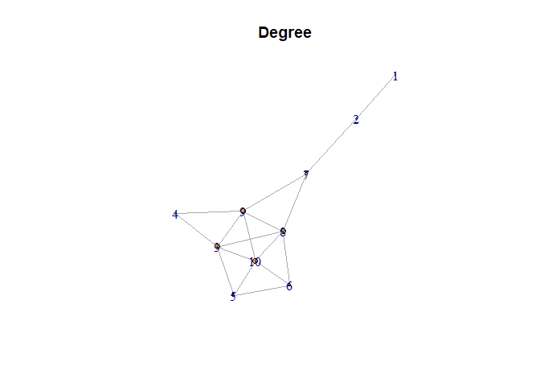

Exercise 2
================

## Importing the Node and Edge Lists

    ## Rows: 10 Columns: 1
    ## ── Column specification ────────────────────────────────────────────────────────
    ## Delimiter: ","
    ## chr (1): Nodes
    ## 
    ## ℹ Use `spec()` to retrieve the full column specification for this data.
    ## ℹ Specify the column types or set `show_col_types = FALSE` to quiet this message.
    ## Rows: 17 Columns: 2
    ## ── Column specification ────────────────────────────────────────────────────────
    ## Delimiter: ","
    ## chr (2): Edge 1, Edge 2
    ## 
    ## ℹ Use `spec()` to retrieve the full column specification for this data.
    ## ℹ Specify the column types or set `show_col_types = FALSE` to quiet this message.

## Network Analysis

Here we will generate our network from our node and edge lists, and then
calculate degree, closeness, eigen and betweenness centrality. These
will be the main 4 metrics I will use in making my decision.

``` r
network <- tbl_graph(nodes=nodes, edges=edges, directed=FALSE)

# Calculate the node metrics
Degree <- degree(network)
Closeness <- closeness(network)
Betweenness <- betweenness(network)
Eig <- evcent(network)$vector
```

Create a dataframe with which to compare centrality values

``` r
comp <- data.frame(nodes, Degree, Eig, Closeness, Betweenness)    # Apply data.frame function
comp 
```

    ##    Nodes Degree        Eig  Closeness Betweenness
    ## 1      1      1 0.03059284 0.03333333   0.0000000
    ## 2      2      2 0.12661070 0.04545455   8.0000000
    ## 3      3      5 0.96744261 0.06250000   4.6333333
    ## 4      4      2 0.46122992 0.05000000   0.0000000
    ## 5      5      3 0.62726236 0.04761905   0.5333333
    ## 6      6      3 0.62852844 0.05263158   0.9333333
    ## 7      A      3 0.49339477 0.06250000  14.0000000
    ## 8      B      5 0.97394849 0.07142857   9.0333333
    ## 9      C      5 0.94139110 0.07142857   8.6000000
    ## 10     D      5 1.00000000 0.06250000   3.2666667

In deciding where I should sit, I would care most about the
EigenCentrality and Closeness centrality. This is because I want to have
strong connections with the largest number of people possible.
Therefore, I would choose to take Seat B. B puts me in a position to be
able to have a conversation and connect with many different people on
the bus. Furthermore, in the event that there were smaller more isolated
cliques on the bus, it also puts me at the best chance to have a
connection with someone within the clique. One major risk with this
strategy is that I don’t know who will sit in the seats surrounding me
on 3 of my 4 sides, or about their connections with the people next to
them.If these people are very introverted, or already have well
established cliques/connections, this could make it harder for me to
form those connections. Another potential consequence of this method has
to do with attention allocation. Because I am sitting so close to so
many individuals, I am giving less attention to each individual, and
therefore may form weaker connections than if I were to focus all of my
attention on just 1 or 2 individuals.

## Plot the Network with Labels

The size of the node is relative to the degree centrality of the node

``` r
plot.igraph(network, 
            vertex.size=degree(network), 
            main="Degree")
```

<!-- -->
