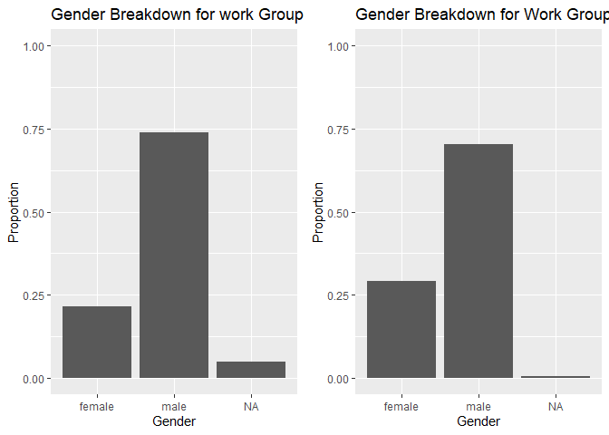
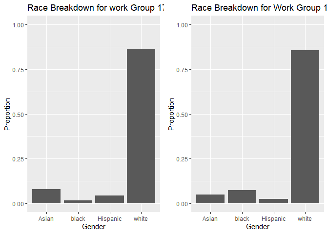
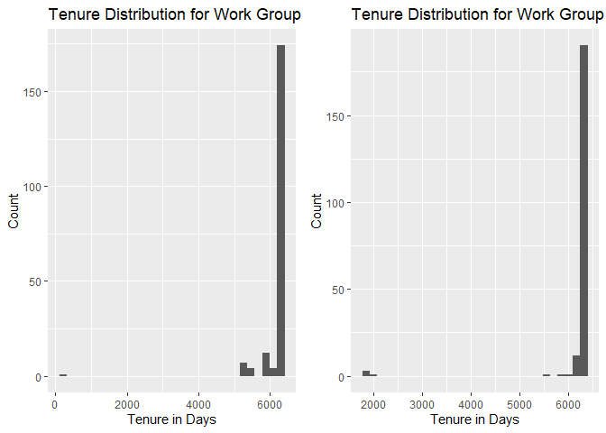
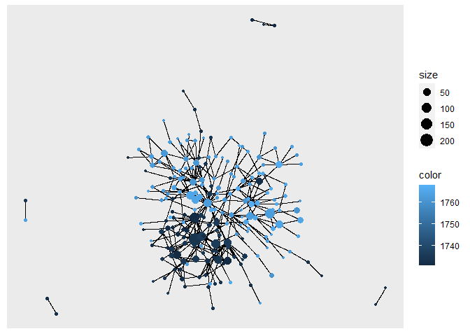

Exercise 3
================

## Load data

Load the following data: + applications from `app_data_sample.parquet` +
edges from `edges_sample.csv`

``` r
# change to your own path!
data_path <- "C:/Users/mattl/OneDrive/Documents/Education/Masters/Courses/Spring Semester/Organizational Network Analysis/2022-ona-assignments/exercises/ex3/672_project_data/"
applications <- read_parquet(paste0(data_path,"app_data_sample.parquet"))
edges <- read_csv(paste0(data_path,"edges_sample.csv"))
```

    ## Rows: 32906 Columns: 4
    ## ── Column specification ────────────────────────────────────────────────────────
    ## Delimiter: ","
    ## chr  (1): application_number
    ## dbl  (2): ego_examiner_id, alter_examiner_id
    ## date (1): advice_date
    ## 
    ## ℹ Use `spec()` to retrieve the full column specification for this data.
    ## ℹ Specify the column types or set `show_col_types = FALSE` to quiet this message.

``` r
applications
```

    ## # A tibble: 2,018,477 × 16
    ##    application_number filing_date examiner_name_last examiner_name_first
    ##    <chr>              <date>      <chr>              <chr>              
    ##  1 08284457           2000-01-26  HOWARD             JACQUELINE         
    ##  2 08413193           2000-10-11  YILDIRIM           BEKIR              
    ##  3 08531853           2000-05-17  HAMILTON           CYNTHIA            
    ##  4 08637752           2001-07-20  MOSHER             MARY               
    ##  5 08682726           2000-04-10  BARR               MICHAEL            
    ##  6 08687412           2000-04-28  GRAY               LINDA              
    ##  7 08716371           2004-01-26  MCMILLIAN          KARA               
    ##  8 08765941           2000-06-23  FORD               VANESSA            
    ##  9 08776818           2000-02-04  STRZELECKA         TERESA             
    ## 10 08809677           2002-02-20  KIM                SUN                
    ## # … with 2,018,467 more rows, and 12 more variables:
    ## #   examiner_name_middle <chr>, examiner_id <dbl>, examiner_art_unit <dbl>,
    ## #   uspc_class <chr>, uspc_subclass <chr>, patent_number <chr>,
    ## #   patent_issue_date <date>, abandon_date <date>, disposal_type <chr>,
    ## #   appl_status_code <dbl>, appl_status_date <chr>, tc <dbl>

``` r
edges
```

    ## # A tibble: 32,906 × 4
    ##    application_number advice_date ego_examiner_id alter_examiner_id
    ##    <chr>              <date>                <dbl>             <dbl>
    ##  1 09402488           2008-11-17            84356             66266
    ##  2 09402488           2008-11-17            84356             63519
    ##  3 09402488           2008-11-17            84356             98531
    ##  4 09445135           2008-08-21            92953             71313
    ##  5 09445135           2008-08-21            92953             93865
    ##  6 09445135           2008-08-21            92953             91818
    ##  7 09479304           2008-12-15            61767             69277
    ##  8 09479304           2008-12-15            61767             92446
    ##  9 09479304           2008-12-15            61767             66805
    ## 10 09479304           2008-12-15            61767             70919
    ## # … with 32,896 more rows

## Get gender for examiners

We’ll get gender based on the first name of the examiner, which is
recorded in the field `examiner_name_first`. We’ll use library `gender`
for that, relying on a modified version of their own
[example](https://cran.r-project.org/web/packages/gender/vignettes/predicting-gender.html).

Note that there are over 2 million records in the applications table –
that’s because there are many records for each examiner, as many as the
number of applications that examiner worked on during this time frame.
Our first step therefore is to get all *unique* names in a separate list
`examiner_names`. We will then guess gender for each one and will join
this table back to the original dataset. So, let’s get names without
repetition:

``` r
library(gender)
#install_genderdata_package() # only run this line the first time you use the package, to get data for it
# get a list of first names without repetitions
examiner_names <- applications %>% 
  distinct(examiner_name_first)
examiner_names
```

    ## # A tibble: 2,595 × 1
    ##    examiner_name_first
    ##    <chr>              
    ##  1 JACQUELINE         
    ##  2 BEKIR              
    ##  3 CYNTHIA            
    ##  4 MARY               
    ##  5 MICHAEL            
    ##  6 LINDA              
    ##  7 KARA               
    ##  8 VANESSA            
    ##  9 TERESA             
    ## 10 SUN                
    ## # … with 2,585 more rows

Now let’s use function `gender()` as shown in the example for the
package to attach a gender and probability to each name and put the
results into the table `examiner_names_gender`

``` r
# get a table of names and gender
examiner_names_gender <- examiner_names %>% 
  do(results = gender(.$examiner_name_first, method = "ssa")) %>% 
  unnest(cols = c(results), keep_empty = TRUE) %>% 
  select(
    examiner_name_first = name,
    gender,
    proportion_female
  )
examiner_names_gender
```

    ## # A tibble: 1,822 × 3
    ##    examiner_name_first gender proportion_female
    ##    <chr>               <chr>              <dbl>
    ##  1 AARON               male              0.0082
    ##  2 ABDEL               male              0     
    ##  3 ABDOU               male              0     
    ##  4 ABDUL               male              0     
    ##  5 ABDULHAKIM          male              0     
    ##  6 ABDULLAH            male              0     
    ##  7 ABDULLAHI           male              0     
    ##  8 ABIGAIL             female            0.998 
    ##  9 ABIMBOLA            female            0.944 
    ## 10 ABRAHAM             male              0.0031
    ## # … with 1,812 more rows

Finally, let’s join that table back to our original applications data
and discard the temporary tables we have just created to reduce clutter
in our environment.

``` r
# remove extra columns from the gender table
examiner_names_gender <- examiner_names_gender %>% 
  select(examiner_name_first, gender)
# joining gender back to the dataset
applications <- applications %>% 
  left_join(examiner_names_gender, by = "examiner_name_first")
# cleaning up
rm(examiner_names)
rm(examiner_names_gender)
gc()
```

    ##            used  (Mb) gc trigger  (Mb) max used  (Mb)
    ## Ncells  4713602 251.8    8145401 435.1  5111524 273.0
    ## Vcells 49902079 380.8   95893548 731.7 80217852 612.1

## Guess the examiner’s race

We’ll now use package `wru` to estimate likely race of an examiner. Just
like with gender, we’ll get a list of unique names first, only now we
are using surnames.

``` r
library(wru)
examiner_surnames <- applications %>% 
  select(surname = examiner_name_last) %>% 
  distinct()
examiner_surnames
```

    ## # A tibble: 3,806 × 1
    ##    surname   
    ##    <chr>     
    ##  1 HOWARD    
    ##  2 YILDIRIM  
    ##  3 HAMILTON  
    ##  4 MOSHER    
    ##  5 BARR      
    ##  6 GRAY      
    ##  7 MCMILLIAN 
    ##  8 FORD      
    ##  9 STRZELECKA
    ## 10 KIM       
    ## # … with 3,796 more rows

We’ll follow the instructions for the package outlined here
<https://github.com/kosukeimai/wru>.

``` r
examiner_race <- predict_race(voter.file = examiner_surnames, surname.only = T) %>% 
  as_tibble()
```

    ## [1] "Proceeding with surname-only predictions..."

    ## Warning in merge_surnames(voter.file): Probabilities were imputed for 698
    ## surnames that could not be matched to Census list.

``` r
examiner_race
```

    ## # A tibble: 3,806 × 6
    ##    surname    pred.whi pred.bla pred.his pred.asi pred.oth
    ##    <chr>         <dbl>    <dbl>    <dbl>    <dbl>    <dbl>
    ##  1 HOWARD       0.643   0.295    0.0237   0.005     0.0333
    ##  2 YILDIRIM     0.861   0.0271   0.0609   0.0135    0.0372
    ##  3 HAMILTON     0.702   0.237    0.0245   0.0054    0.0309
    ##  4 MOSHER       0.947   0.00410  0.0241   0.00640   0.0185
    ##  5 BARR         0.827   0.117    0.0226   0.00590   0.0271
    ##  6 GRAY         0.687   0.251    0.0241   0.0054    0.0324
    ##  7 MCMILLIAN    0.359   0.574    0.0189   0.00260   0.0463
    ##  8 FORD         0.620   0.32     0.0237   0.0045    0.0313
    ##  9 STRZELECKA   0.666   0.0853   0.137    0.0797    0.0318
    ## 10 KIM          0.0252  0.00390  0.00650  0.945     0.0198
    ## # … with 3,796 more rows

As you can see, we get probabilities across five broad US Census
categories: white, black, Hispanic, Asian and other. (Some of you may
correctly point out that Hispanic is not a race category in the US
Census, but these are the limitations of this package.)

Our final step here is to pick the race category that has the highest
probability for each last name and then join the table back to the main
applications table. See this example for comparing values across
columns: <https://www.tidyverse.org/blog/2020/04/dplyr-1-0-0-rowwise/>.
And this one for `case_when()` function:
<https://dplyr.tidyverse.org/reference/case_when.html>.

``` r
examiner_race <- examiner_race %>% 
  mutate(max_race_p = pmax(pred.asi, pred.bla, pred.his, pred.oth, pred.whi)) %>% 
  mutate(race = case_when(
    max_race_p == pred.asi ~ "Asian",
    max_race_p == pred.bla ~ "black",
    max_race_p == pred.his ~ "Hispanic",
    max_race_p == pred.oth ~ "other",
    max_race_p == pred.whi ~ "white",
    TRUE ~ NA_character_
  ))
examiner_race
```

    ## # A tibble: 3,806 × 8
    ##    surname    pred.whi pred.bla pred.his pred.asi pred.oth max_race_p race 
    ##    <chr>         <dbl>    <dbl>    <dbl>    <dbl>    <dbl>      <dbl> <chr>
    ##  1 HOWARD       0.643   0.295    0.0237   0.005     0.0333      0.643 white
    ##  2 YILDIRIM     0.861   0.0271   0.0609   0.0135    0.0372      0.861 white
    ##  3 HAMILTON     0.702   0.237    0.0245   0.0054    0.0309      0.702 white
    ##  4 MOSHER       0.947   0.00410  0.0241   0.00640   0.0185      0.947 white
    ##  5 BARR         0.827   0.117    0.0226   0.00590   0.0271      0.827 white
    ##  6 GRAY         0.687   0.251    0.0241   0.0054    0.0324      0.687 white
    ##  7 MCMILLIAN    0.359   0.574    0.0189   0.00260   0.0463      0.574 black
    ##  8 FORD         0.620   0.32     0.0237   0.0045    0.0313      0.620 white
    ##  9 STRZELECKA   0.666   0.0853   0.137    0.0797    0.0318      0.666 white
    ## 10 KIM          0.0252  0.00390  0.00650  0.945     0.0198      0.945 Asian
    ## # … with 3,796 more rows

Let’s join the data back to the applications table.

``` r
# removing extra columns
examiner_race <- examiner_race %>% 
  select(surname,race)
applications <- applications %>% 
  left_join(examiner_race, by = c("examiner_name_last" = "surname"))
rm(examiner_race)
rm(examiner_surnames)
gc()
```

    ##            used  (Mb) gc trigger  (Mb) max used  (Mb)
    ## Ncells  5128218 273.9    8145401 435.1  8145401 435.1
    ## Vcells 53701543 409.8   95893548 731.7 94775580 723.1

## Examiner’s tenure

To figure out the timespan for which we observe each examiner in the
applications data, let’s find the first and the last observed date for
each examiner. We’ll first get examiner IDs and application dates in a
separate table, for ease of manipulation. We’ll keep examiner ID (the
field `examiner_id`), and earliest and latest dates for each application
(`filing_date` and `appl_status_date` respectively). We’ll use functions
in package `lubridate` to work with date and time values.

``` r
library(lubridate) # to work with dates
examiner_dates <- applications %>% 
  select(examiner_id, filing_date, appl_status_date) 
examiner_dates
```

    ## # A tibble: 2,018,477 × 3
    ##    examiner_id filing_date appl_status_date  
    ##          <dbl> <date>      <chr>             
    ##  1       96082 2000-01-26  30jan2003 00:00:00
    ##  2       87678 2000-10-11  27sep2010 00:00:00
    ##  3       63213 2000-05-17  30mar2009 00:00:00
    ##  4       73788 2001-07-20  07sep2009 00:00:00
    ##  5       77294 2000-04-10  19apr2001 00:00:00
    ##  6       68606 2000-04-28  16jul2001 00:00:00
    ##  7       89557 2004-01-26  15may2017 00:00:00
    ##  8       97543 2000-06-23  03apr2002 00:00:00
    ##  9       98714 2000-02-04  27nov2002 00:00:00
    ## 10       65530 2002-02-20  23mar2009 00:00:00
    ## # … with 2,018,467 more rows

The dates look inconsistent in terms of formatting. Let’s make them
consistent. We’ll create new variables `start_date` and `end_date`.

``` r
examiner_dates <- examiner_dates %>% 
  mutate(start_date = ymd(filing_date), end_date = as_date(dmy_hms(appl_status_date)))
```

Let’s now identify the earliest and the latest date for each examiner
and calculate the difference in days, which is their tenure in the
organization.

``` r
examiner_dates <- examiner_dates %>% 
  group_by(examiner_id) %>% 
  summarise(
    earliest_date = min(start_date, na.rm = TRUE), 
    latest_date = max(end_date, na.rm = TRUE),
    tenure_days = interval(earliest_date, latest_date) %/% days(1)
    ) %>% 
  filter(year(latest_date)<2018)
examiner_dates
```

    ## # A tibble: 5,625 × 4
    ##    examiner_id earliest_date latest_date tenure_days
    ##          <dbl> <date>        <date>            <dbl>
    ##  1       59012 2004-07-28    2015-07-24         4013
    ##  2       59025 2009-10-26    2017-05-18         2761
    ##  3       59030 2005-12-12    2017-05-22         4179
    ##  4       59040 2007-09-11    2017-05-23         3542
    ##  5       59052 2001-08-21    2007-02-28         2017
    ##  6       59054 2000-11-10    2016-12-23         5887
    ##  7       59055 2004-11-02    2007-12-26         1149
    ##  8       59056 2000-03-24    2017-05-22         6268
    ##  9       59074 2000-01-31    2017-03-17         6255
    ## 10       59081 2011-04-21    2017-05-19         2220
    ## # … with 5,615 more rows

Joining back to the applications data.

``` r
applications <- applications %>% 
  left_join(examiner_dates, by = "examiner_id")
rm(examiner_dates)
gc()
```

    ##            used  (Mb) gc trigger   (Mb)  max used   (Mb)
    ## Ncells  5141706 274.6   14691490  784.7  14691490  784.7
    ## Vcells 66079179 504.2  138262708 1054.9 137918458 1052.3

## Select 2 Workgroups to focus on

``` r
wg173 <- applications[substr(applications$examiner_art_unit, 1, 3) == 173,]
wg175 <- applications[substr(applications$examiner_art_unit, 1, 3) == 175,]
```

## Demographics

First, we will take these dataframes and get unique occurrences based on
the examiner_id column. This way, our demographics won’t be skewed by
repititions of the same examiner.

``` r
wg173_unique <- wg173[row.names(unique(wg173[,"examiner_id"])),]
wg175_unique <- wg175[row.names(unique(wg175[,"examiner_id"])),]
```

``` r
summary(wg173_unique)
```

    ##  application_number  filing_date         examiner_name_last examiner_name_first
    ##  Length:206         Min.   :2000-01-03   Length:206         Length:206         
    ##  Class :character   1st Qu.:2000-01-10   Class :character   Class :character   
    ##  Mode  :character   Median :2000-01-18   Mode  :character   Mode  :character   
    ##                     Mean   :2000-02-25                                         
    ##                     3rd Qu.:2000-03-01                                         
    ##                     Max.   :2004-04-06                                         
    ##                                                                                
    ##  examiner_name_middle  examiner_id    examiner_art_unit  uspc_class       
    ##  Length:206           Min.   :59475   Min.   :1731      Length:206        
    ##  Class :character     1st Qu.:67628   1st Qu.:1731      Class :character  
    ##  Mode  :character     Median :75991   Median :1732      Mode  :character  
    ##                       Mean   :79870   Mean   :1732                        
    ##                       3rd Qu.:94650   3rd Qu.:1733                        
    ##                       Max.   :99587   Max.   :1734                        
    ##                                                                           
    ##  uspc_subclass      patent_number      patent_issue_date   
    ##  Length:206         Length:206         Min.   :2000-10-03  
    ##  Class :character   Class :character   1st Qu.:2002-03-05  
    ##  Mode  :character   Mode  :character   Median :2002-07-09  
    ##                                        Mean   :2002-10-18  
    ##                                        3rd Qu.:2003-03-04  
    ##                                        Max.   :2011-12-13  
    ##                                        NA's   :39          
    ##   abandon_date        disposal_type      appl_status_code appl_status_date  
    ##  Min.   :2000-11-28   Length:206         Min.   :150.0    Length:206        
    ##  1st Qu.:2001-11-04   Class :character   1st Qu.:150.0    Class :character  
    ##  Median :2002-06-07   Mode  :character   Median :250.0    Mode  :character  
    ##  Mean   :2002-08-21                      Mean   :203.1                      
    ##  3rd Qu.:2002-11-12                      3rd Qu.:250.0                      
    ##  Max.   :2006-09-01                      Max.   :250.0                      
    ##  NA's   :167                                                                
    ##        tc          gender              race           earliest_date       
    ##  Min.   :1700   Length:206         Length:206         Min.   :2000-01-03  
    ##  1st Qu.:1700   Class :character   Class :character   1st Qu.:2000-01-04  
    ##  Median :1700   Mode  :character   Mode  :character   Median :2000-01-07  
    ##  Mean   :1700                                         Mean   :2000-01-08  
    ##  3rd Qu.:1700                                         3rd Qu.:2000-01-10  
    ##  Max.   :1700                                         Max.   :2000-03-10  
    ##                                                       NA's   :4           
    ##   latest_date          tenure_days  
    ##  Min.   :2000-09-14   Min.   : 251  
    ##  1st Qu.:2017-04-14   1st Qu.:6308  
    ##  Median :2017-05-19   Median :6339  
    ##  Mean   :2017-01-18   Mean   :6220  
    ##  3rd Qu.:2017-05-22   3rd Qu.:6344  
    ##  Max.   :2017-05-23   Max.   :6350  
    ##  NA's   :4            NA's   :4

``` r
summary(wg175_unique)
```

    ##  application_number  filing_date         examiner_name_last examiner_name_first
    ##  Length:209         Min.   :2000-01-03   Length:209         Length:209         
    ##  Class :character   1st Qu.:2000-01-18   Class :character   Class :character   
    ##  Mode  :character   Median :2000-02-17   Mode  :character   Mode  :character   
    ##                     Mean   :2000-03-18                                         
    ##                     3rd Qu.:2000-04-04                                         
    ##                     Max.   :2003-03-28                                         
    ##                                                                                
    ##  examiner_name_middle  examiner_id    examiner_art_unit  uspc_class       
    ##  Length:209           Min.   :59227   Min.   :1751      Length:209        
    ##  Class :character     1st Qu.:65042   1st Qu.:1751      Class :character  
    ##  Mode  :character     Median :73327   Median :1753      Mode  :character  
    ##                       Mean   :77164   Mean   :1753                        
    ##                       3rd Qu.:91210   3rd Qu.:1755                        
    ##                       Max.   :99879   Max.   :1756                        
    ##                                                                           
    ##  uspc_subclass      patent_number      patent_issue_date   
    ##  Length:209         Length:209         Min.   :1997-03-04  
    ##  Class :character   Class :character   1st Qu.:2001-08-24  
    ##  Mode  :character   Mode  :character   Median :2002-05-10  
    ##                                        Mean   :2002-06-24  
    ##                                        3rd Qu.:2002-12-29  
    ##                                        Max.   :2007-08-14  
    ##                                        NA's   :63          
    ##   abandon_date        disposal_type      appl_status_code appl_status_date  
    ##  Min.   :2000-08-22   Length:209         Min.   :150.0    Length:209        
    ##  1st Qu.:2001-06-16   Class :character   1st Qu.:150.0    Class :character  
    ##  Median :2001-12-14   Mode  :character   Median :161.0    Mode  :character  
    ##  Mean   :2002-05-09                      Mean   :195.6                      
    ##  3rd Qu.:2002-11-29                      3rd Qu.:250.0                      
    ##  Max.   :2005-10-13                      Max.   :250.0                      
    ##  NA's   :146                                                                
    ##        tc          gender              race           earliest_date       
    ##  Min.   :1700   Length:209         Length:209         Min.   :2000-01-03  
    ##  1st Qu.:1700   Class :character   Class :character   1st Qu.:2000-01-04  
    ##  Median :1700   Mode  :character   Mode  :character   Median :2000-01-06  
    ##  Mean   :1700                                         Mean   :2000-01-07  
    ##  3rd Qu.:1700                                         3rd Qu.:2000-01-07  
    ##  Max.   :1700                                         Max.   :2000-06-02  
    ##                                                                           
    ##   latest_date          tenure_days  
    ##  Min.   :2005-04-06   Min.   :1913  
    ##  1st Qu.:2017-05-12   1st Qu.:6330  
    ##  Median :2017-05-19   Median :6345  
    ##  Mean   :2017-02-05   Mean   :6239  
    ##  3rd Qu.:2017-05-23   3rd Qu.:6347  
    ##  Max.   :2017-07-24   Max.   :6391  
    ## 

### Comparing Gender Breakdown

``` r
library(gridExtra)
```

    ## 
    ## Attaching package: 'gridExtra'

    ## The following object is masked from 'package:dplyr':
    ## 
    ##     combine

``` r
a <- ggplot(data=wg173_unique, aes(x=gender)) +
  geom_bar(aes(y = (..count..)/sum(..count..)) )  +
  ylab("Proportion")+
  xlab("Gender")+
  ylim(0,1)+
  ggtitle(paste0("Gender Breakdown for work Group 173"))

b <- ggplot(data=wg175_unique, aes(x=gender)) +
  geom_bar(aes(y = (..count..)/sum(..count..))) +
  ylab("Proportion")+
  xlab("Gender")+
  ylim(0,1)+
  ggtitle(paste0("Gender Breakdown for Work Group 175"))
grid.arrange(a,b,ncol=2, widths=c(1,1))
```

<!-- --> We can see above
that Work Group 173 has a slightly higher proportion of males than Work
Group 175.

### Comparing Race Breakdown

``` r
a <- ggplot(data=wg173_unique, aes(x=race)) +
  geom_bar(aes(y = (..count..)/sum(..count..)) )  +
  ylab("Proportion")+
  xlab("Gender")+
  ylim(0,1)+
  ggtitle(paste0("Race Breakdown for work Group 173"))

b <- ggplot(data=wg175_unique, aes(x=race)) +
  geom_bar(aes(y = (..count..)/sum(..count..))) +
  ylab("Proportion")+
  xlab("Gender")+
  ylim(0,1)+
  ggtitle(paste0("Race Breakdown for Work Group 175"))
grid.arrange(a,b,ncol=2, widths=c(1,1))
```

<!-- --> Here, we can see
that both groups are predominantly white, however, work group 173 seem
to have higher proportions of asian and hispanic examiners, whereas work
group 175 has a higher proportion of black examiners.

### Comparing Tenure

``` r
a <- ggplot(data=wg173_unique, aes(x=tenure_days)) +
  geom_histogram(bins=30) +
  ylab("Count")+
  xlab("Tenure in Days")+
  ggtitle(paste0("Tenure Distribution for Work Group 173"))

b <- ggplot(data=wg175_unique, aes(x=tenure_days)) +
  geom_histogram(bins=30) +
  ylab("Count")+
  xlab("Tenure in Days")+
  ggtitle(paste0("Tenure Distribution for Work Group 173"))
grid.arrange(a,b,ncol=2, widths=c(1,1))
```

    ## Warning: Removed 4 rows containing non-finite values (stat_bin).

<!-- --> When considering
tenure, we can see that both work groups have examiners with a ton of
experience, with the vast majority of both groups having at least 5500
days of tenure. However, work group 175 also seems to have more newer
employees than work group 173.

## Advice Networks

``` r
# first get work group for each examiner and limit to our two wgs of interest
examiner_aus = distinct(subset(applications, select=c(examiner_art_unit, examiner_id)))

# we eventually want to make a network with nodes colored by work group, so lets add that indicator
examiner_aus$wg = substr(examiner_aus$examiner_art_unit, 1,3)

# restrict down to our selected art units to reduce merging complexity later on
examiner_aus = examiner_aus[examiner_aus$wg==173 | examiner_aus$wg==176,]

# now we will merge in the aus df on applications 
tM = merge(x=edges, y=examiner_aus, by.x="ego_examiner_id", by.y="examiner_id", all.x=TRUE)
tM = tM %>% rename(ego_art_unit=examiner_art_unit, ego_wg=wg)

tM = drop_na(tM)

# now repeat for the alter examiners
tM = merge(x=tM, y=examiner_aus, by.x="alter_examiner_id", by.y="examiner_id", all.x=TRUE)
tM = tM %>% rename(alter_art_unit=examiner_art_unit, alter_wg=wg)
tM = drop_na(tM)
```

``` r
# we are left with 870 edges corresponding to instances of examiners in wg173 or wg175 asking for advice
egoNodes = subset(tM, select=c(ego_examiner_id,ego_art_unit, ego_wg)) %>% rename(examiner_id=ego_examiner_id,art_unit=ego_art_unit,wg=ego_wg)
alterNodes = subset(tM, select=c(alter_examiner_id,alter_art_unit, alter_wg))%>% rename(examiner_id=alter_examiner_id,art_unit=alter_art_unit,wg=alter_wg)
nodes = rbind(egoNodes, alterNodes)
nodes = distinct(nodes)

# problem: when we reduce to the list of distinct vertices, we actually have more than we should, since some examiners move amongst art units/wgs in this data subset
nodes = nodes %>% group_by(examiner_id) %>% summarise(examiner_id=first(examiner_id), art_unit=first(art_unit), wg=first(wg))
```

``` r
network <- graph_from_data_frame(d=tM, vertices=nodes, directed=TRUE)
network
```

    ## IGRAPH b5429f8 DN-- 213 1289 -- 
    ## + attr: name (v/c), art_unit (v/n), wg (v/c), application_number (e/c),
    ## | advice_date (e/n), ego_art_unit (e/n), ego_wg (e/c), alter_art_unit
    ## | (e/n), alter_wg (e/c)
    ## + edges from b5429f8 (vertex names):
    ##  [1] 59196->84867 59196->84867 59196->84867 59227->98045 59227->71655
    ##  [6] 59227->61615 59227->71655 59475->93715 59475->69794 59706->97705
    ## [11] 59706->66436 59706->97705 59706->66436 59706->71655 59706->66436
    ## [16] 59816->71143 59816->71143 59870->59165 59975->71142 59975->92487
    ## [21] 59975->94301 59975->95799 59975->71142 59975->95799 59975->71142
    ## [26] 59975->71142 59975->94301 59975->92487 59975->94301 59975->94301
    ## + ... omitted several edges

``` r
# Calculate the node metrics
Degree <- degree(network)
Closeness <- closeness(network)
Betweenness <- betweenness(network)
Eig <- evcent(network)$vector

V(network)$size <- Degree
V(network)$color <- nodes$art_unit

comp <- data.frame(nodes, Degree, Eig, Closeness, Betweenness)   
comp 
```

    ##       examiner_id art_unit  wg Degree          Eig  Closeness Betweenness
    ## 59165       59165     1762 176      5 2.990040e-06        NaN   0.0000000
    ## 59196       59196     1732 173      3 0.000000e+00 1.00000000   0.0000000
    ## 59227       59227     1734 173      4 2.424310e-03 0.33333333   0.0000000
    ## 59359       59359     1734 173     20 5.181738e-04        NaN   0.0000000
    ## 59475       59475     1732 173      2 3.446762e-07 0.50000000   0.0000000
    ## 59706       59706     1731 173      6 2.252742e-02 0.33333333   0.0000000
    ## 59771       59771     1732 173      1 3.502417e-13        NaN   0.0000000
    ## 59816       59816     1761 176      2 1.666665e-08 1.00000000   0.0000000
    ## 59870       59870     1762 176      2 2.494773e-06 1.00000000   0.0000000
    ## 59975       59975     1763 176     16 4.536700e-07 0.14285714   0.0000000
    ## 59987       59987     1735 173     47 2.604724e-01 1.00000000   4.0000000
    ## 60397       60397     1761 176      1 1.060423e-04        NaN   0.0000000
    ## 60431       60431     1731 173      1 7.027228e-11        NaN   0.0000000
    ## 60575       60575     1736 173      8 1.266958e-04        NaN   0.0000000
    ## 60584       60584     1763 176      2 1.475557e-04        NaN   0.0000000
    ## 60706       60706     1764 176      2 6.730897e-04 0.50000000   0.0000000
    ## 61182       61182     1762 176      2 3.202759e-09 0.25000000   0.0000000
    ## 61615       61615     1735 173     10 4.249327e-02        NaN   0.0000000
    ## 62064       62064     1763 176      4 3.139109e-05 0.33333333   0.0000000
    ## 62098       62098     1731 173     67 6.906670e-01        NaN   0.0000000
    ## 62164       62164     1761 176      1 1.585583e-07 0.33333333   0.0000000
    ## 62346       62346     1733 173      4 2.112587e-02        NaN   0.0000000
    ## 62498       62498     1731 173      7 4.896199e-02 0.50000000   0.0000000
    ## 63011       63011     1733 173      2 5.535815e-05        NaN   0.0000000
    ## 63065       63065     1731 173      1 3.578942e-09 1.00000000   0.0000000
    ## 63188       63188     1761 176      3 5.034641e-07 0.33333333   0.0000000
    ## 63277       63277     1762 176      1 1.668153e-07        NaN   0.0000000
    ## 63324       63324     1732 173      2 1.642156e-03 1.00000000   1.0000000
    ## 63363       63363     1761 176      9 1.028597e-06 0.25000000   0.0000000
    ## 63366       63366     1763 176      3 1.190186e-08 1.00000000   0.0000000
    ## 63422       63422     1763 176      5 3.075055e-05 0.33333333   0.0000000
    ## 63532       63532     1765 176      2 2.120847e-04        NaN   0.0000000
    ## 63609       63609     1764 176      3 9.135071e-05 0.04166667   0.0000000
    ## 63735       63735     1766 176     11 1.515624e-06        NaN   0.0000000
    ## 63752       63752     1761 176     19 4.770228e-05        NaN   0.0000000
    ## 63842       63842     1734 173      1 1.605762e-07        NaN   0.0000000
    ## 63938       63938     1762 176      1 9.607225e-09 1.00000000   0.0000000
    ## 64002       64002     1762 176      1 2.463506e-06        NaN   0.0000000
    ## 64053       64053     1736 173     88 2.005009e-02 0.04545455  14.0000000
    ## 64940       64940     1736 173      8 3.347259e-04 0.20000000  11.0000000
    ## 65031       65031     1765 176     10 0.000000e+00        NaN   0.0000000
    ## 65403       65403     1763 176      3 1.538691e-05 0.33333333   0.0000000
    ## 65474       65474     1765 176      2 7.223689e-08 0.33333333   0.0000000
    ## 65547       65547     1764 176      6 1.323049e-03        NaN   0.0000000
    ## 65757       65757     1764 176      2 4.259245e-06 0.50000000   0.0000000
    ## 65919       65919     1734 173      4 3.072211e-05 0.50000000   0.0000000
    ## 66118       66118     1765 176      1 3.642995e-06 0.08333333   0.0000000
    ## 66344       66344     1765 176      2 1.283767e-06        NaN   0.0000000
    ## 66436       66436     1731 173    107 6.652670e-01        NaN   0.0000000
    ## 66450       66450     1765 176      4 1.605062e-08 0.14285714   0.0000000
    ## 66762       66762     1764 176      6 6.058430e-05 0.25000000   0.0000000
    ## 67217       67217     1735 173      4 7.195275e-04        NaN   0.0000000
    ## 67331       67331     1765 176      2 8.492265e-08 1.00000000   1.0000000
    ## 67409       67409     1761 176      1 1.221193e-08 1.00000000   0.0000000
    ## 67698       67698     1736 173     55 2.477666e-03 0.03571429   0.0000000
    ## 67901       67901     1731 173      3 0.000000e+00        NaN   0.0000000
    ## 68165       68165     1734 173      5 1.765719e-02 0.50000000   0.0000000
    ## 68169       68169     1762 176     25 2.355868e-04 0.07142857   0.0000000
    ## 68227       68227     1732 173      1 0.000000e+00 1.00000000   0.0000000
    ## 68384       68384     1762 176      6 1.110096e-04        NaN   0.0000000
    ## 68511       68511     1763 176      8 1.376369e-07 0.50000000   0.0000000
    ## 68546       68546     1731 173      2 1.391325e-02 1.00000000   0.0000000
    ## 68603       68603     1733 173      6 2.646969e-03 0.50000000   0.0000000
    ## 68970       68970     1733 173      6 1.347270e-03 0.20000000   4.0000000
    ## 69099       69099     1762 176      1 1.160816e-06 1.00000000   0.0000000
    ## 69193       69193     1733 173      7 1.993958e-03 0.20000000   0.0000000
    ## 69209       69209     1763 176      3 8.143248e-06 0.33333333   0.0000000
    ## 69304       69304     1765 176     53 3.454032e-06 1.00000000   2.0000000
    ## 69402       69402     1765 176      3 1.613797e-04 0.50000000   0.0000000
    ## 69539       69539     1764 176      1 6.335236e-07        NaN   0.0000000
    ## 69711       69711     1761 176      2 2.151187e-08        NaN   0.0000000
    ## 69794       69794     1764 176      1 3.604242e-09        NaN   0.0000000
    ## 69800       69800     1764 176      6 1.316450e-03 0.50000000   4.0000000
    ## 70176       70176     1732 173     12 3.462663e-04        NaN   0.0000000
    ## 70227       70227     1732 173      7 4.325846e-05        NaN   0.0000000
    ## 70610       70610     1766 176      7 3.990608e-06 0.05555556   0.0000000
    ## 70887       70887     1761 176      1 3.642995e-06 0.08333333   0.0000000
    ## 71101       71101     1733 173      2 1.322906e-03 1.00000000   0.0000000
    ## 71119       71119     1765 176     11 2.595815e-04 1.00000000   1.0131579
    ## 71142       71142     1763 176      9 3.422567e-07        NaN   0.0000000
    ## 71143       71143     1767 176     47 7.969218e-07        NaN   0.0000000
    ## 71174       71174     1734 173      6 3.590378e-05 1.00000000   2.0000000
    ## 71243       71243     1764 176      2 2.102952e-04        NaN   0.0000000
    ## 71353       71353     1761 176     10 9.864912e-04 0.20000000  15.0000000
    ## 71655       71655     1734 173     11 6.304499e-02        NaN   0.0000000
    ## 71704       71704     1765 176      5 1.365879e-06 1.00000000   3.0000000
    ## 71762       71762     1761 176      5 1.516304e-05 1.00000000  14.0000000
    ## 72052       72052     1736 173     31 3.640561e-04        NaN   0.0000000
    ## 72102       72102     1736 173      5 2.093385e-02        NaN   0.0000000
    ## 72153       72153     1736 173      6 4.781865e-04        NaN   0.0000000
    ## 72524       72524     1731 173      4 4.659826e-04 1.00000000   2.0000000
    ## 72613       72613     1764 176      1 1.042436e-07        NaN   0.0000000
    ## 72638       72638     1765 176      3 5.777293e-07 0.11111111   0.0000000
    ## 72666       72666     1731 173     23 1.148867e-01 0.14285714   0.0000000
    ## 72809       72809     1765 176     24 9.968885e-06 0.06250000   0.0000000
    ## 72838       72838     1761 176      2 4.316667e-07 1.00000000   0.0000000
    ## 73074       73074     1733 173      2 3.349456e-11 1.00000000   1.0000000
    ## 73213       73213     1762 176      1 3.642995e-06 0.08333333   0.0000000
    ## 73327       73327     1761 176      4 2.777985e-07 0.50000000   0.0000000
    ## 73383       73383     1734 173      5 4.245448e-04 0.33333333   1.0000000
    ## 73689       73689     1731 173      2 0.000000e+00 1.00000000   0.0000000
    ## 73692       73692     1761 176      9 5.311409e-04        NaN   0.0000000
    ## 74579       74579     1761 176      5 1.604887e-05 1.00000000   1.0000000
    ## 74684       74684     1735 173      5 1.335006e-03 0.25000000   0.0000000
    ## 75341       75341     1762 176     38 1.468346e-03        NaN   0.0000000
    ## 75367       75367     1731 173      1 1.201358e-03        NaN   0.0000000
    ## 75387       75387     1762 176      8 1.502776e-05 0.16666667   0.0000000
    ## 75406       75406     1733 173      8 8.045307e-05 0.12500000   0.0000000
    ## 75409       75409     1733 173      8 9.387317e-05 1.00000000   3.0000000
    ## 75461       75461     1762 176      4 1.053716e-05 0.09090909   6.0000000
    ## 75718       75718     1761 176     28 5.978307e-06        NaN   0.0000000
    ## 75774       75774     1735 173     17 3.027557e-03        NaN   0.0000000
    ## 75933       75933     1735 173      2 0.000000e+00        NaN   0.0000000
    ## 76081       76081     1762 176      1 3.809858e-08 1.00000000   0.0000000
    ## 76347       76347     1768 176      2 1.818776e-04 0.09090909   0.0000000
    ## 76370       76370     1761 176     10 5.093681e-08 1.00000000   0.0000000
    ## 76447       76447     1762 176      1 4.991429e-04 1.00000000   0.0000000
    ## 76622       76622     1765 176      3 1.073806e-04 0.50000000   2.0000000
    ## 76727       76727     1734 173     68 7.625639e-03        NaN   0.0000000
    ## 76959       76959     1731 173      3 6.425859e-07        NaN   0.0000000
    ## 77068       77068     1763 176     64 1.014090e-02 0.01818182   0.0000000
    ## 77112       77112     1732 173     12 8.696539e-03 0.20000000  15.0000000
    ## 77294       77294     1762 176      6 7.761626e-05 0.11111111   0.0000000
    ## 77791       77791     1732 173      6 3.651377e-04        NaN   0.0000000
    ## 78003       78003     1736 173      1 2.590869e-05        NaN   0.0000000
    ## 78056       78056     1767 176      2 3.643393e-06        NaN   0.0000000
    ## 78379       78379     1765 176      3 4.206504e-08        NaN   0.0000000
    ## 79564       79564     1731 173     48 3.430802e-03 0.50000000   0.6923077
    ## 80826       80826     1731 173      1 1.585583e-07 0.33333333   0.0000000
    ## 82563       82563     1761 176      3 2.133280e-04 0.02564103   0.0000000
    ## 82735       82735     1764 176     20 1.728357e-04 0.16666667   0.0000000
    ## 83091       83091     1765 176      2 3.805413e-06 1.00000000   0.0000000
    ## 83398       83398     1765 176     33 1.986453e-03 0.50000000   0.1578947
    ## 84157       84157     1763 176    102 2.041820e-05 0.20000000   0.0000000
    ## 84289       84289     1734 173      1 0.000000e+00        NaN   0.0000000
    ## 84609       84609     1762 176      1 1.668153e-07        NaN   0.0000000
    ## 84867       84867     1733 173      3 0.000000e+00        NaN   0.0000000
    ## 85449       85449     1763 176      9 2.417530e-05        NaN   0.0000000
    ## 85599       85599     1765 176      3 1.220065e-07        NaN   0.0000000
    ## 86201       86201     1765 176     24 2.928356e-05 0.14285714   0.0000000
    ## 86212       86212     1767 176      2 4.042140e-07 1.00000000   0.0000000
    ## 87124       87124     1765 176      4 4.182051e-05 0.25000000   0.0000000
    ## 88202       88202     1762 176     19 7.745570e-04 0.20000000  10.0000000
    ## 89539       89539     1734 173    212 1.000000e+00 0.05555556   0.0000000
    ## 89550       89550     1767 176     11 1.317207e-03 1.00000000   6.0000000
    ## 90241       90241     1764 176      2 0.000000e+00 1.00000000   0.0000000
    ## 90946       90946     1762 176      1 2.463506e-06        NaN   0.0000000
    ## 90956       90956     1736 173     83 2.374555e-02 0.04000000   2.0000000
    ## 91048       91048     1732 173      2 1.815694e-04        NaN   0.0000000
    ## 91833       91833     1766 176      2 0.000000e+00        NaN   0.0000000
    ## 92238       92238     1764 176      4 9.187456e-07        NaN   0.0000000
    ## 92476       92476     1767 176      3 4.941947e-07 1.00000000   1.0000000
    ## 92487       92487     1762 176     43 1.831436e-06        NaN   0.0000000
    ## 92510       92510     1762 176      3 4.606300e-05 1.00000000   0.0000000
    ## 92537       92537     1764 176      6 1.482422e-06 1.00000000   0.0000000
    ## 92612       92612     1762 176      8 1.167835e-06        NaN   0.0000000
    ## 92733       92733     1733 173      2 1.322906e-03 1.00000000   0.0000000
    ## 93432       93432     1765 176     11 2.940618e-05 1.00000000   3.0394737
    ## 93626       93626     1735 173     19 1.486450e-01        NaN   0.0000000
    ## 93653       93653     1761 176      4 2.064029e-05        NaN   0.0000000
    ## 93715       93715     1734 173      4 3.295802e-05        NaN   0.0000000
    ## 93896       93896     1765 176     66 7.666272e-04        NaN   0.0000000
    ## 93909       93909     1734 173      1 0.000000e+00 1.00000000   0.0000000
    ## 94238       94238     1734 173      9 6.305949e-02        NaN   0.0000000
    ## 94301       94301     1763 176      6 3.519732e-07        NaN   0.0000000
    ## 94341       94341     1762 176      3 8.105161e-06        NaN   0.0000000
    ## 94390       94390     1765 176     32 1.120948e-06 0.25000000   0.0000000
    ## 94737       94737     1763 176      2 3.062485e-07        NaN   0.0000000
    ## 94899       94899     1761 176      4 2.221634e-05 1.00000000   0.0000000
    ## 95210       95210     1764 176      3 2.231814e-06        NaN   0.0000000
    ## 95459       95459     1735 173     23 4.853531e-02 0.16666667   6.0000000
    ## 95464       95464     1766 176      1 1.101859e-07 0.05555556   0.0000000
    ## 95660       95660     1734 173     18 4.190995e-02 0.09090909   0.0000000
    ## 95799       95799     1765 176      6 1.645912e-05 1.00000000   5.0000000
    ## 95814       95814     1732 173      4 1.819571e-04        NaN   0.0000000
    ## 95860       95860     1762 176      2 1.327631e-06 1.00000000   1.0000000
    ## 96068       96068     1734 173      8 7.642382e-04 0.09090909  14.3076923
    ## 96267       96267     1731 173      6 4.215384e-02        NaN   0.0000000
    ## 96304       96304     1761 176      2 8.345873e-08        NaN   0.0000000
    ## 96371       96371     1732 173      5 2.955919e-02 0.33333333   0.0000000
    ## 96439       96439     1732 173     42 2.283251e-06 0.16666667   0.0000000
    ## 96500       96500     1731 173      2 6.720188e-09 0.50000000   0.0000000
    ## 96532       96532     1767 176     28 2.362751e-05        NaN   0.0000000
    ## 96556       96556     1732 173      2 1.535601e-05 0.50000000   0.0000000
    ## 96568       96568     1733 173      9 1.032918e-03 0.03846154   0.0000000
    ## 96912       96912     1762 176     19 1.595267e-05 0.08333333   0.0000000
    ## 97024       97024     1736 173     10 3.368937e-04 0.25000000   0.0000000
    ## 97287       97287     1766 176     16 1.635178e-05 0.33333333   4.0000000
    ## 97312       97312     1762 176      1 5.167741e-09 0.33333333   0.0000000
    ## 97553       97553     1736 173      1 4.523491e-07 1.00000000   0.0000000
    ## 97650       97650     1762 176      5 3.138862e-06 0.33333333   2.0000000
    ## 97692       97692     1761 176      5 4.008270e-05 1.00000000   0.0000000
    ## 97705       97705     1731 173     14 4.773338e-02        NaN   0.0000000
    ## 97745       97745     1734 173      2 4.601969e-07 0.25000000   0.0000000
    ## 97889       97889     1766 176      2 3.299561e-07        NaN   0.0000000
    ## 97957       97957     1764 176      4 3.333330e-08 1.00000000   0.0000000
    ## 98045       98045     1733 173     23 6.325519e-02        NaN   0.0000000
    ## 98098       98098     1761 176      3 2.742259e-08 1.00000000   0.0000000
    ## 98163       98163     1762 176      2 2.120847e-04        NaN   0.0000000
    ## 98297       98297     1765 176     50 6.523469e-04 0.50000000   0.7894737
    ## 98394       98394     1766 176      4 3.189620e-04 1.00000000   0.0000000
    ## 98469       98469     1735 173      3 2.093970e-02        NaN   0.0000000
    ## 98582       98582     1762 176     19 3.483821e-04 0.16666667  38.0000000
    ## 98804       98804     1765 176      5 2.756332e-05 0.25000000   3.0000000
    ## 98891       98891     1731 173      6 7.055425e-03 0.08333333   7.0000000
    ## 98943       98943     1736 173      1 4.523491e-07 1.00000000   0.0000000
    ## 98995       98995     1733 173      2 2.345380e-05 0.11111111   0.0000000
    ## 99207       99207     1732 173      6 4.228281e-02 0.50000000   0.0000000
    ## 99224       99224     1765 176      5 8.549439e-07 0.16666667   0.0000000
    ## 99240       99240     1763 176     55 2.535177e-05        NaN   0.0000000
    ## 99316       99316     1735 173     28 1.720223e-02 0.09090909   0.0000000
    ## 99879       99879     1731 173     16 1.193452e-01 1.00000000   0.0000000
    ## 99930       99930     1764 176      4 1.702266e-08 1.00000000   0.0000000

``` r
ggraph(network, layout="kk") +
  geom_edge_link()+
  geom_node_point(aes(size=size, color=color), show.legend=T)
```

<!-- --> Using the graph
above, we can see a good amount of mixing with individuals seeking
advice from those outside their respective work group’s. The two work
group id’s I selected are close to each other numerically (173 and 176),
so it could be likely that these work groups are also near each other in
terms of subject matter of the patents. This would explain why we see
such an intermixing of advice between the two groups.

In terms of centrality scores, the main 4 that I chose to examine were
degree, betweenness, closeness, and eigen vector. Looking at the ‘comp’
dataframe created to compare the examiners respective centrality scores,
we can see the examiner with the id 89539 has almost double the degree
centrality of the next highest examiner. He or she also has a perfect
eigen vector score of 1. Meaning not only do they have many instances of
seeking advice or being sought after for advice, they also are doing
this with the most important people in the network. Looking a bit more
in depth at this specific examiner:

``` r
ex_89539 <- applications[applications$examiner_id == 89539,]
```

Here, we can see that Jerry has been around for quite a long time (6318
days), spanning from 2001 up until 2017. In that time, he has been the
examiner for over 9000 patents.A deeper analysis here could also be
beneficial to look at the variety of these patents as this could explain
such a high degree centrality.

When looking at the betweenness scores for the nodes in the network, we
see that they are relatively low (aside from examiner 98582), which is
likely due to the clustered shape of the network, indicating that it is
fairly well connected and it is often not too detrimental to find
another path through the network if one of the nodes were missing.
